## POWER BI DASHBOARD
Panel de analíticas para ventas, el mismo se procesa con datos en tiempo real importados desde el sistema actual (COBOL).
- 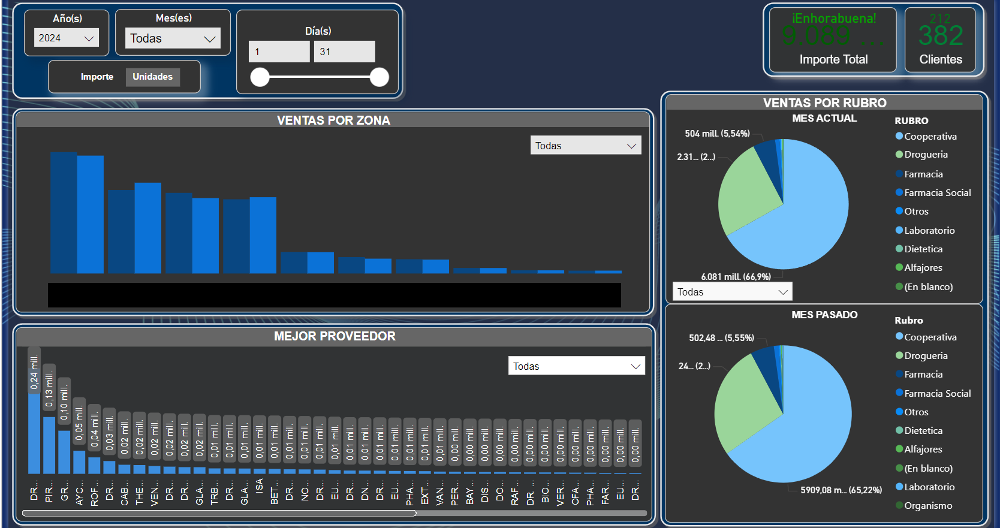
- Tags: DG
- Lenguajes:
  - SQL [pink]
  - Power BI [yellow]
  - JavaScript [orange]
  - Node JS [green]
- Enlace: [#](#)
- Descripción detallada:
  Este proyecto es un panel de analíticas para ventas que procesa datos en tiempo real importados desde el sistema actual. Se utiliza SQL, Power BI y Node JS para lograr una experiencia completa y eficiente. Lamentablemente esté proyecto es privado y no puedo proporcionar un enlace para visualizar debido a que contiene datos sensibles, si quieres saber más información, podes contactarme sin problema.
- Carrousel:
  - 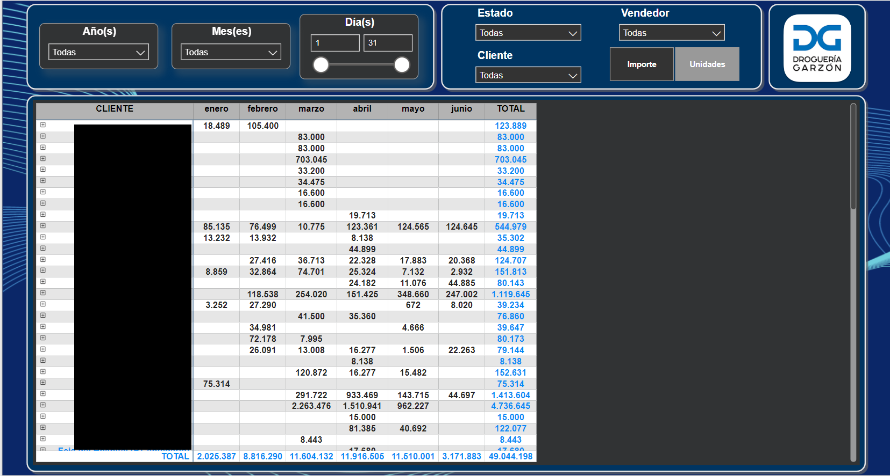
  -  
##
##
## PDF VIEWER ONLINE
Un visor de PDF ONLINE. Hecho con TypeScript
- 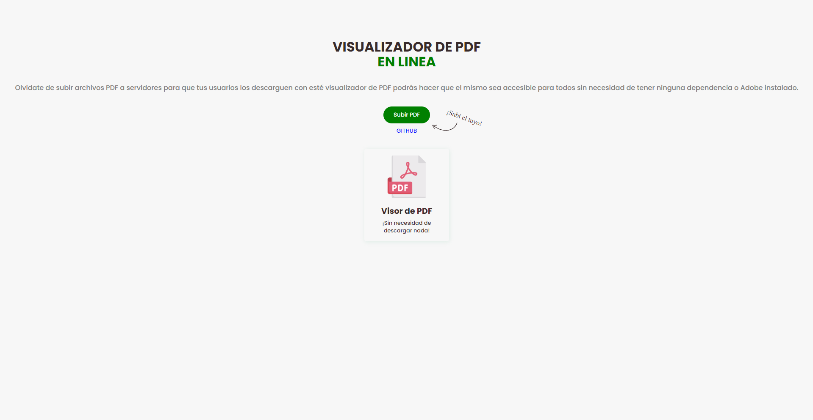
- Tags: AG
- Lenguajes:
  - TypeScript [blue]
  - React.js [yellow]
- Enlace: [https://github.com/DarioAlbor/PDFViewer](https://github.com/DarioAlbor/PDFViewer)
- Enlace: [https://github.com/DarioAlbor/PDFViewer](https://github.com/DarioAlbor/PDFViewer)
- Descripción detallada:
  Visualizador de PDF en línea que permite a los usuarios ver archivos PDF sin necesidad de descargarlos. (Sin BACKEND aún, solo sirve de DEMO con un PDF estatico de prueba)
- Carrousel:
  - 
##
##
## ADVENTURE GAME
Juego de aventura basado en elecciones.
- 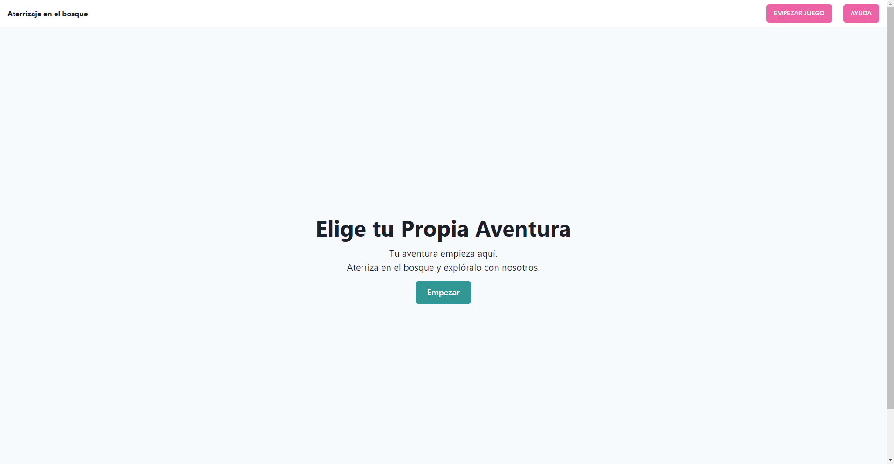
- Tags: AG
- Lenguajes:
  - React.js [blue]
  - Chakra UI [green]
- Enlace: [https://github.com/DarioAlbor/AdventureGame](https://github.com/DarioAlbor/AdventureGame)
- Enlace: [https://github.com/DarioAlbor/AdventureGame](https://github.com/DarioAlbor/AdventureGame)
- Descripción detallada:
  Imagina que sos parte de la tripulación de cabina en un vuelo que se estrelló en el bosque. Tendrás que tomar decisiones como equipo para navegar por el bosque, buscar agua, comida y refugio, y encontrar ayuda. Después de cada decisión, se presentará la siguiente situación basada en la decisión tomada anteriormente. Trabaja en equipo para tomar decisiones sabias y garantizar la supervivencia de todos los miembros de la tripulación y los pasajeros.
- Carrousel:
  - 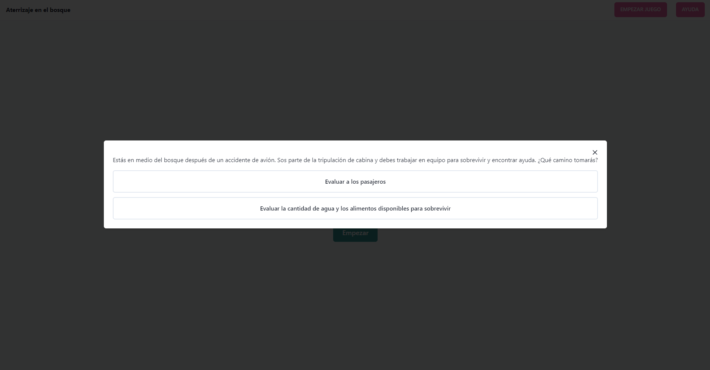
  - 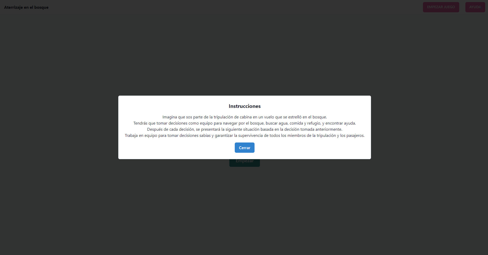
##
##
## CHAT ONLINE
Chat Online donde puedes registrarte, iniciar sesión e interactuar con otros usuarios, estén conectados o no
- 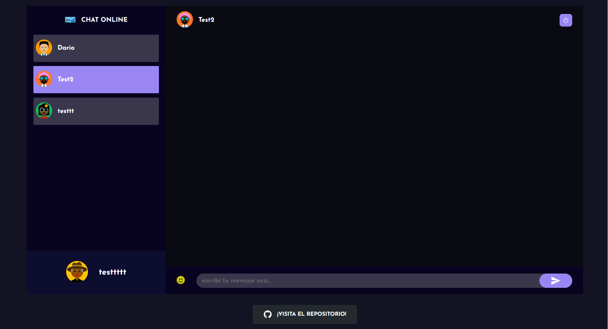
- Tags: CO
- Lenguajes:
  - React.js [blue]
  - Node.js [green]
  - Socket.io [yellow]
  - MongoDB [purple]
- Enlace: [https://github.com/DarioAlbor/ChatOnline](https://github.com/DarioAlbor/ChatOnline)
- Enlace: [https://github.com/DarioAlbor/ChatOnline](https://github.com/DarioAlbor/ChatOnline)
- Descripción detallada:
  Este proyecto es un Chat Online donde puedes registrarte, iniciar sesión e interactuar con otros usuarios, estén conectados o no. Utiliza un mecanismo sencillo para la comunicación entre el cliente y el servidor, garantizando una experiencia fluida y eficiente.
- Carrousel:
  - 
  - 
  - 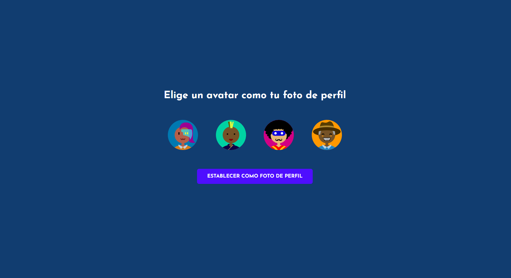
  - 
##
##
## CHALLENGE POKEMON
¡Selecciona tu Pokémon favorito y participa en emocionantes batallas estratégicas! 🚀
- 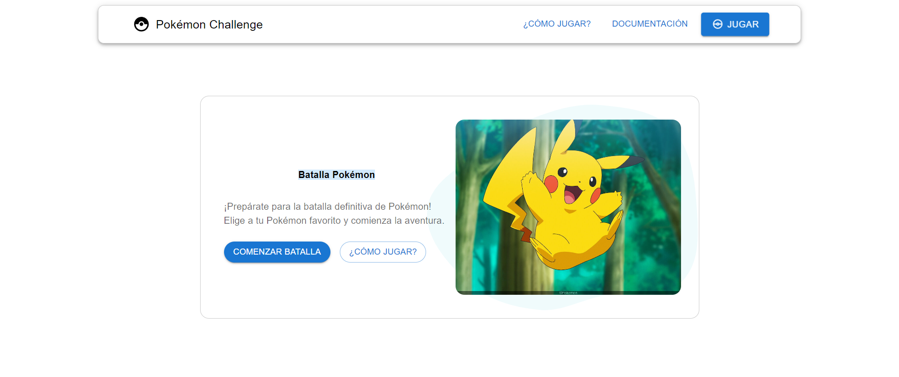
- Tags: Pokemon
- Lenguajes:
  - React.js [blue]
  - Nest.js [red]
  - Material-UI [green]
  - SQLite [purple]
- Enlace: [https://github.com/DarioAlbor/ChallengePokemon](https://github.com/DarioAlbor/ChallengePokemon)
- Enlace: [https://github.com/DarioAlbor/ChallengePokemon](https://github.com/DarioAlbor/ChallengePokemon)
- Descripción detallada:
Este proyecto es un juego de batalla entre pokémones donde los jugadores pueden seleccionar sus pokémones y enfrentarse en una batalla estratégica. Utiliza un algoritmo específico para determinar el ganador basado en las estadísticas de los pokémones.
- Carrousel:
  - 
  - 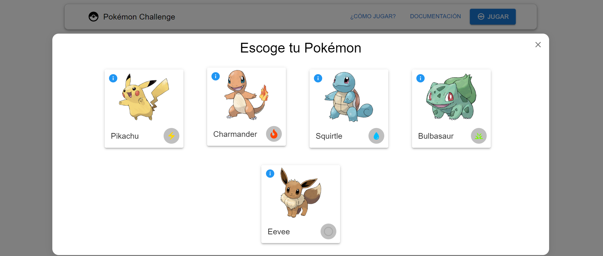
  - 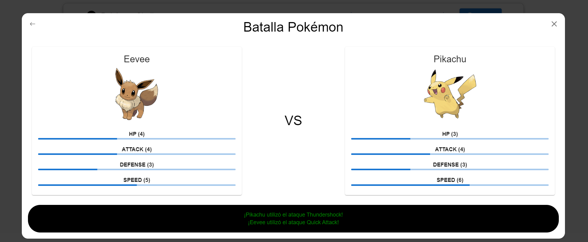
  - 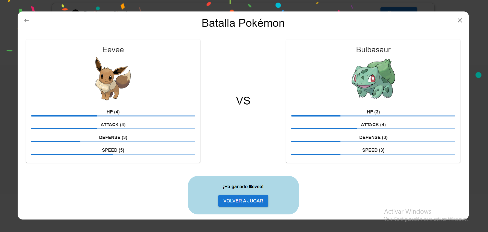
##
##
## SIMPLE AUTH
SimpleAuth es un proyecto utilizando el manejo de autentificación y sesiones. 🔒
- 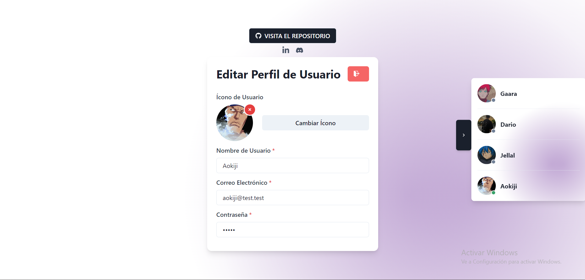
- Tags: SimpleAuth
- Lenguajes:
  - React.js [blue]
  - Node.js [yellow]
  - Chakra-UI [red]
  - MongoDB [green]
  - JWT [purple]
- Enlace: [https://github.com/DarioAlbor/SimpleAuth](https://github.com/DarioAlbor/SimpleAuth)
- Enlace: [https://github.com/DarioAlbor/SimpleAuth](https://github.com/DarioAlbor/SimpleAuth)
- Descripción detallada:
SimpleAuth es un proyecto utilizando el manejo de autentificación y sesiones, permitiendo el registro, ingreso y sesiones activas y seguras utilizando JWT. También permitiendo la opción de cambiar la imagen de perfil, contraseña (cifrada con hash MD5), visualización en tiempo real de usuarios conectados/desconectados.
- Carrousel:
  - 
  - 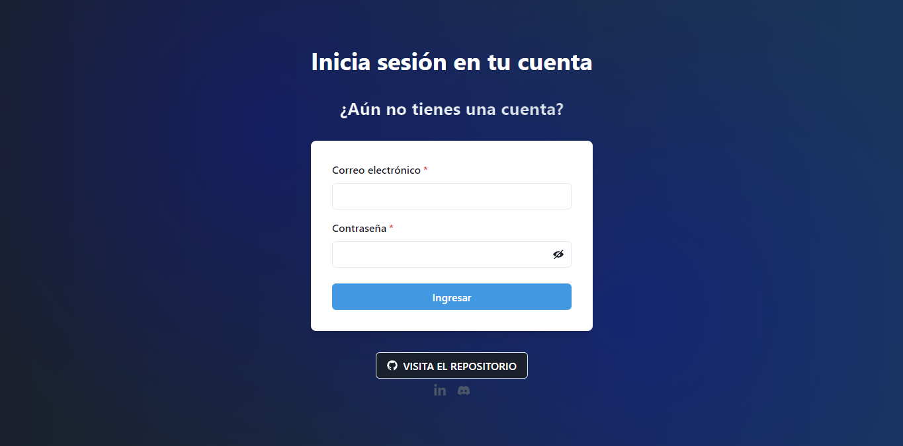
  - 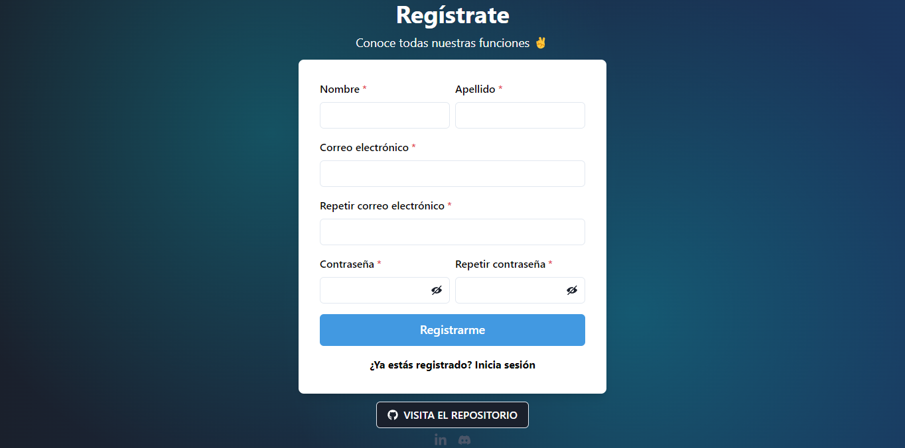
  - 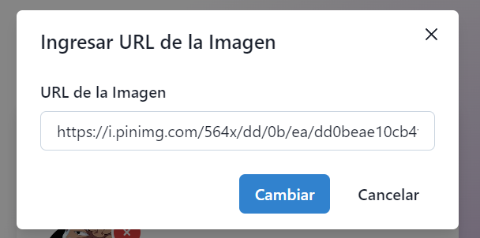